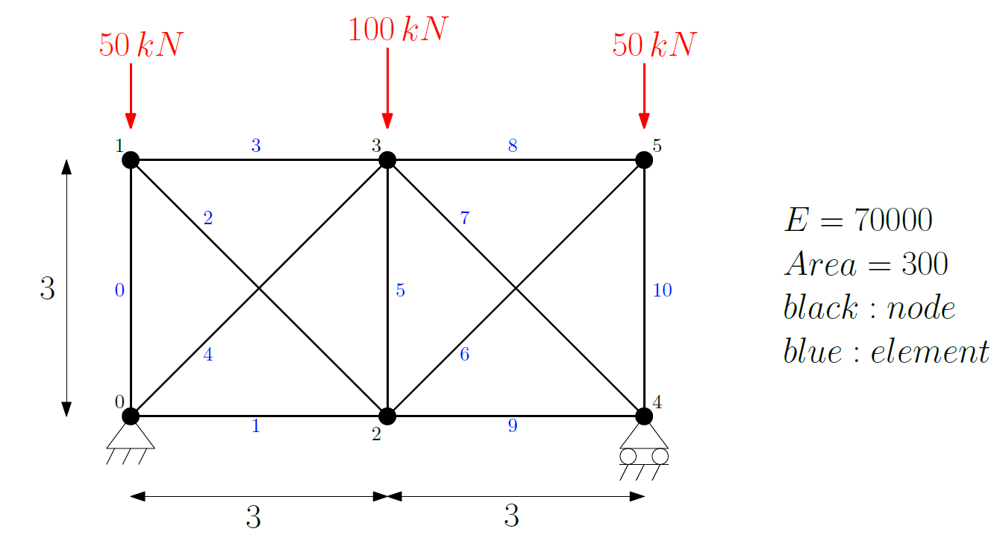

# Finite Element - 2D Truss

This code has been written for educational purposes.

## Reference
This code is mainly based on 'A.J.M. Ferreira, MATLAB Codes for Finite Element Analysis, _Solid Mechanics and its Applications_, 2014, DOI: https://doi.org/10.1007/978-1-4020-9200-8'

## Presentation
`demo.py` shows how to use `FeaTruss2D`. This demo deals with the following case:

### Inputs
Their are two `.txt` inputs and five parameters to write into the main code.

| Name | Description |
|------|-------------|
| nodesCoor.txt | Text file with a list of the coordinates of all the nodes. |
| elementsConnect.txt | Text file with a list of the connected nodes for each element. |
| restricted_dof | `List` of all __degree of freedom__ restricted to 0. |
| loaded_dof | `List` of all __degree of freedom__ where a load is applied. The direction depends on the _dof_ and the sign. |
| values_load | `List` of all assigned load. |
| E | Young's modulus. |
| A | Cross section area of all elements (unique section). |

### Outputs

+ List of all nodal displacements.
+ List of all nodal reactions.
+ List of all element stress.

 

+ Display of the undeformed structure with all boundary conditions.
+ Display of the deformed structure.
+ Display of the deformed structure with a colour scale representing the compression or tension in all the elements.

